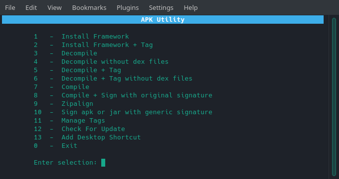

# Apk Utility v2.4

Apk Utility is for decompiling, compiling, zipaligning, and signing android apk and jar files. The utility also has the ability to tag your framework files. This is a very useful feature if you want to install framework files for multiple different devices without having to remove one for the other. Basically a tag is a label to distinguish between multiple devices' framework files.

## Usage

Tested on ubuntu & manjaro
For 64 bit systems only

1. Make sure to have java 8+ installed on your computer.
2. Make sure the `apku` file is executable.
3. Place all your apk and jar files in the input folder. If zipaligning only, place them in the zipalign folder.
4. Execute the file as follows in a terminal: `./apku`
5. Optional: Use the "Add Desktop Shortcut" option for quick access.

**To use tags, install your framework files with tags(menu option 2).**

## Framework Files

As you probably know, Android apps utilize code and resources that are found on the Android OS itself. These are known as framework resources and [Apktool](https://ibotpeaches.github.io/Apktool/) relies on these to properly decode and build apks.

Every [Apktool](https://ibotpeaches.github.io/Apktool/) release contains internally the most up to date AOSP framework at the time of the release. This allows you to decode and build most apks without a problem. However, manufacturers add their own framework files in addition to the regular AOSP ones. To use apktool against these manufacturer apks you must first install the manufacturer framework files.

**To install framework files use menu options 1 or 2.**

## Project Page

https://techstop.github.io/apk-utility/

## Resources

- [Apktool](https://ibotpeaches.github.io/Apktool/)